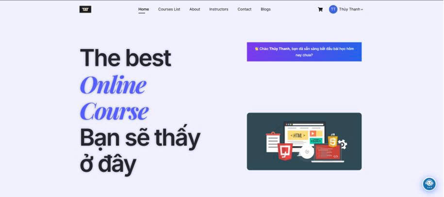
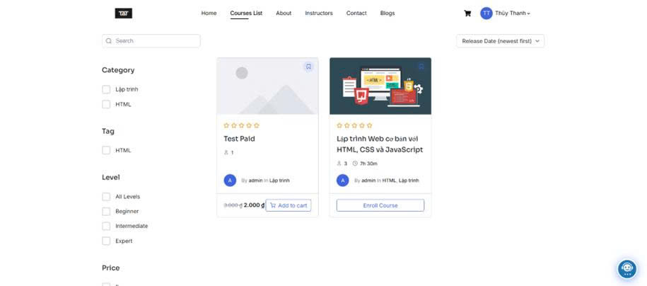
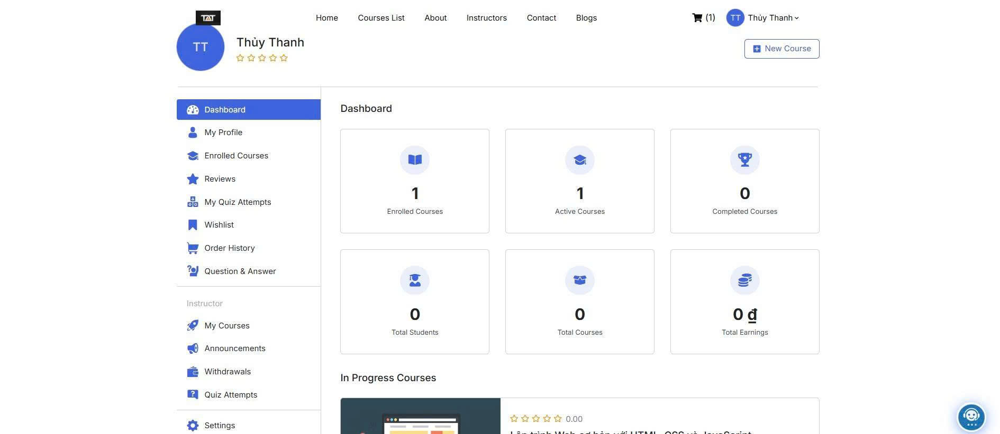
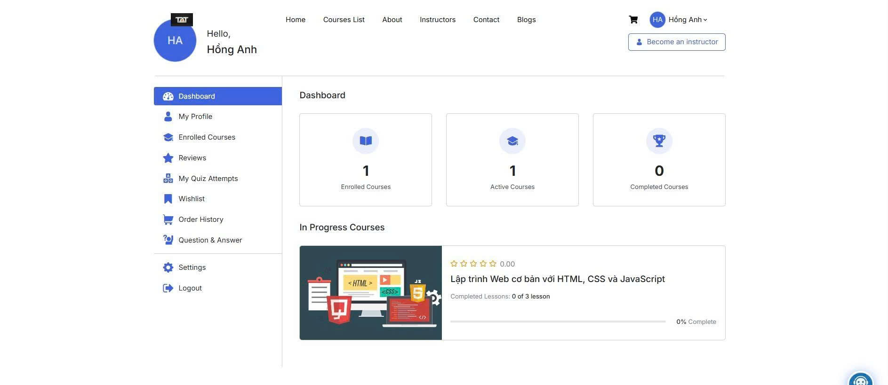
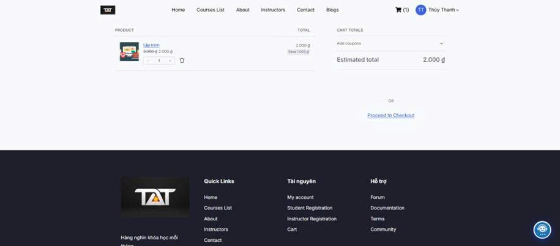
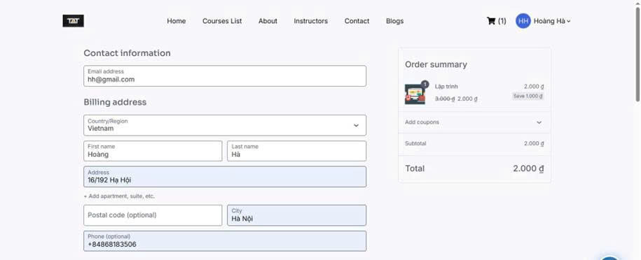
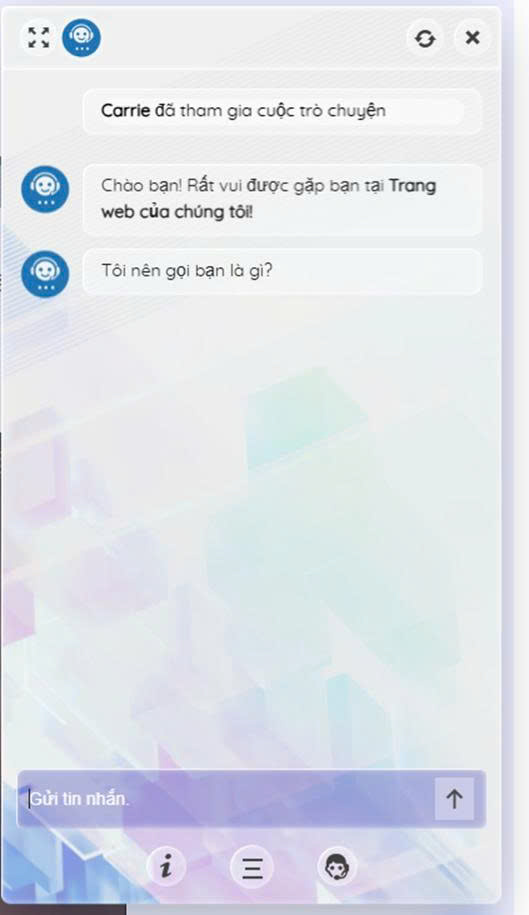

# HỆ THỐNG E-LEARNING HỖ TRỢ HỌC TẬP TRỰC TUYẾN

## Giới thiệu hệ thống
Hệ thống E-Learning hỗ trợ học tập trực tuyến được xây dựng bằng WordPress kết hợp Tutor LMS và WooCommerce. Hệ thống hỗ trợ quản lý khóa học, học video bài giảng, Lesson, Quiz, đăng ký tài khoản Student và Instructor, giỏ hàng, thanh toán bằng VietQR và SePay, AI Chatbot WPBot, quản lý học viên và tiến độ học tập cùng Learning Notification Bar hỗ trợ nhắc nhở học tập.

---

## Danh sách thành viên

| Họ và tên | MSSV |
|---|---|
| Nguyễn Thị Thanh Thủy | 23810310205 |
| Phí Thị Minh Thảo | 23810310159 |
| Tạ Thị Ngọc Ánh | 23810310194 |
| Nguyễn Văn Luận | 23810310279|


---
# Phân công nhiệm vụ

| STT | Nội dung công việc chính | Người thực hiện | Tỷ lệ đóng góp |
|---|---|---|---|
| 1 | **HỆ THỐNG CỐT LÕI & TÍCH HỢP NÂNG CAO**  <br> - Thiết kế cấu trúc hệ thống và giao diện cốt lõi (Trang chủ, MetForm). <br> - Cấu hình API và cổng thanh toán tự động qua VietQR và tích hợp SePay. <br> - Xây dựng phân hệ khóa học nâng cao (Curriculum, bài giảng, video). <br> - Tùy chỉnh Elementor. <br> - Quản lý tiến độ nhóm. <br> - Tổng hợp báo cáo đồ án. <br> - Kiểm thử hệ thống. | **Tạ Thị Ngọc Ánh** | 25% |
| 2 | **NỀN TẢNG, KHẢO THÍ & GIAO DIỆN PHỤ TRỢ** <br> - Khởi tạo Localhost, cơ sở dữ liệu và phân tích yêu cầu. <br> - Xây dựng hệ thống bài thi trắc nghiệm (Quiz): Quản lý ngân hàng câu hỏi, chấm điểm tự động. <br> - Tích hợp Chatbot AI hỗ trợ và xây dựng giao diện các trang phụ (Blog, Giảng viên). <br> - Chịu trách nhiệm nội dung báo cáo Chương 2, 3. | **Nguyễn Thị Thanh Thủy** | 25% |
| 3 | **THƯƠNG MẠI ĐIỆN TỬ & LẬP TRÌNH PLUGIN** <br> - Xây dựng chức năng Đăng ký/Đăng nhập và logic phân quyền thành viên. <br> - Deploy website lên hosting. <br> - Trực tiếp lập trình và cấu hình Plugin tùy chỉnh thanh thông báo (Notification Bar). <br> - Chịu trách nhiệm nội dung báo cáo Chương 3, 4 và tổng hợp, căn chỉnh file Word. | **Phí Thị Minh Thảo** | 25% |
| 4 | **HỆ THỐNG NGƯỜI DÙNG & XỬ LÝ ĐƠN HÀNG** <br> - Xây dựng trang Hồ sơ cá nhân (Dashboard Profile) và cổng Hỏi - Đáp (Q&A) tương tác. <br> - Cấu hình luồng mua sắm, giỏ hàng và xử lý logic đơn hàng qua WooCommerce. <br> - Chịu trách nhiệm chính nội dung báo cáo Chương 1, 2. | **Nguyễn Văn Luận** | 25% |
| **Tổng cộng** |  |  | **100%** |
---

## Công nghệ sử dụng
## Frontend
- HTML5
- CSS3
- JavaScript
- Elementor

## Backend
- PHP
- WordPress

## Database
- MySQL

## Plugin sử dụng
- Tutor LMS
- WooCommerce
- Elementor
- MetForm
- VietQR
- WPBot AI Chatbot
- SePay Gateway

---

## Hướng dẫn cài đặt
- Cài đặt XAMPP
- Khởi động Apache và MySQL
- Copy project `Phan_mem_mo` vào:
```bash
C:\xampp\htdocs\
```

- Truy cập:
```bash
http://localhost/phpmyadmin
```

- Tạo database mới, import file .sql
- Truy cập:
```bash
http://localhost/Phan_mem_mo
```

- Tiến hành cấu hình WordPress và cài đặt Plugin

---

## Hướng dẫn chạy Project
- Mở XAMPP
- Start Apache và MySQL
- Truy cập:
```bash
http://localhost/Phan_mem_mo
```

---

## Tài khoản Demo

### Admin
- Username: admin
- Password: 123456

---
## Hình ảnh minh họa hệ thống

### Trang chủ


### Danh sách khóa học


### Dashboard Instructor


### Dashboard Student


### Cart & Thanh toán




### AI Chatbot


---

## Link Video Demo Google Drive
```txt
https://drive.google.com/drive/folders/1PvAAG3UsrmcyJEh-5TXqOV0fkMlfoAUp?usp=sharing
```

---

## Link Video Demo Youtube
```txt
https://youtu.be/iD5QARI1UQo
```

---

## Link Deploy Online

```txt
https://phiminhthao19.id.vn/

```